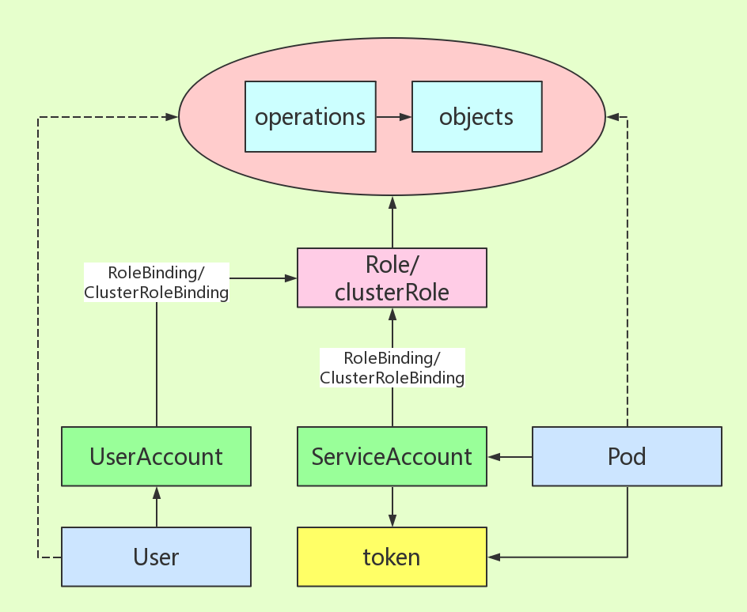
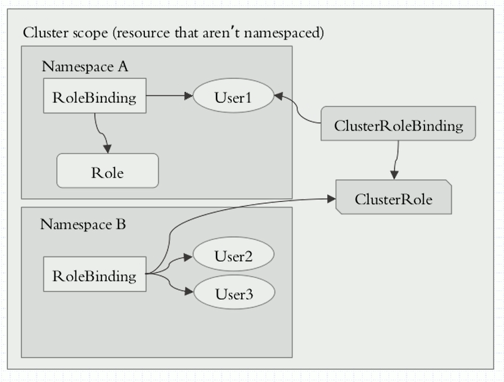

# 一、授权简介
## 1、账户类型
* User Account
>用于客户端操作 API_Server

* Service Account
>用于 Pod 操作 API_Server

## 2、授权插件
>Node、ABAC、RBAC、Webhook

## 3、RBAC(Role-Based Access Control)
* RBAC简介
>判断【Who是否可以对What进行How的访问操作】这个逻辑表达式的值是否为True的求解过程
>
>最小特权原则、责任分离原则和数据抽象原则

* 角色（role）
* 许可（Permissions）
```
a、将 Operation 与 Objects 组合为 Permission
b、再将 Permissions 绑定 role
c、Account 使用 role ，即可 Operation 操作 Objects
```

# 二、账户与角色的关系


## 1、名称解释
* role
>对名称空间资源进行操作
>>包含operations与objects

* rolebinding
>将绑定到角色

* clusterrole
>对集群级别的资源操作

* clusterrolebinding
>将用户绑定到集群角色

## 2、三种绑定方式，也适用ServiceAccount
* user -- rolebinding -- role
* user -- clusterrolebinding -- clusterrole
* user -- rolebinding -- clusterrole
>可以将用户与集群角色绑定，使 clusterrole 降级到某一名称空间中
>
>从而使user具有所在名称空间的绝对权限



# 三、Service Account
## 1、SA创建方法
```
kubectl create serviceaccount NAME [--dry-run] [options]
```
>创建 serviceAccount 时，会自动创建一个 secret 的 token 与之绑定

## 2、Pod使用SA
>pod.spec.serviceAccountName

## 3、查看任意Pod信息
>每个Pod默认会使用所在namespace的默认SA来获取自身状态
>
>使用SA时，会将对应的 secret 挂载到 Pod 的 /var/run/secrets/kubernetes.io/serviceaccount
```yaml
spec:
  containers:
  - volumeMounts:
    - mountPath: /var/run/secrets/kubernetes.io/serviceaccount
      name: default-token-2r625
      readOnly: true
  serviceAccount: default
  serviceAccountName: default
  volumes:
  - name: default-token-2r625
    secret:
      defaultMode: 420
      secretName: default-token-2r625
```

# 四、User Account
## 1、UserAccount包含
```
user: username,uid
group: 
extra:
API
Request path
HTTP request verb:
    get post put delete
API request verb:
    get list create update patch watch proxy redirect delete deletecollection
Resource
Subresource
Namespace
API group
```

## 2、Request path
* 格式
>/apis/{apiGroup}/{apiVersion}/namespaces/{namespaceName}/{TYPE}/{resourceName}/
>
>有些资源不属于 namespaces，则没有 namespaces/{namespaceName} 这一节

* 使用示例
>/apis/apps/v1/namespaces/default/deployments/myapp-deploy/
```bash
curl http://192.168.112.171:8080/api/v1/namespaces
```
```
{
  "kind": "NamespaceList",
  "apiVersion": "v1",
  "metadata": {
    "selfLink": "/api/v1/namespaces",
    "resourceVersion": "531001"
  },
  ...
}
```

# 五、创建role与rolebinding
## 1、创建role
* 命令行创建
```bash
kubectl create role NAME --verb=verb --resource=resource.group/subresource [--resource-name=resourcename] [--dry-run]

--dry-run=false     如果为ture，表示不真实创建，只是打印过程测试
--resource=         指定操作的对象TYPE
--resource-name=    指定多个resource的具体名称，必须是TYPE的子集
```

* 命令行例举

```bash
kubectl create role pods-reader --verb=get,list --resource=pods --resource-name=busybox --resource-name=myapp-0  --dry-run -o yaml
```

* 配置文件创建
```yaml
apiVersion: rbac.authorization.k8s.io/v1
kind: Role
metadata:
  name: pods-reader
  namespace: default
rules:
- apiGroups:                # 包含TYPE的apiVersion
  - ""
  resources:                # 操作的资源TYPE
  - pods
  resourceNames:            # TYPE中具体的资源名称
  - busybox
  - myapp-0
  verbs:                    # 可用的操作
  - get
  - list
- apiGroups:                # 多个资源TYPE并列为列表
  ...
```

## 2、创建rolebinding
* 命令行创建
```bash
kubectl create rolebinding NAME --clusterrole=NAME|--role=NAME [--user=username] [--group=groupname]
[--serviceaccount=namespace:serviceaccountname] [--dry-run] [options]

--role              指定role
--user              指定user
```

* 命令行例举
```
kubectl create rolebinding test-read-pods --role=pods-reader --user=test-user --dry-run -o yaml
```

* 配置文件创建
```yaml
apiVersion: rbac.authorization.k8s.io/v1
kind: RoleBinding
metadata:
  name: test-read-pods
  namespace: default
roleRef:
  apiGroup: rbac.authorization.k8s.io
  kind: Role
  name: pods-reader         # role的名称
subjects:
- apiGroup: rbac.authorization.k8s.io
  kind: User                # 可以是User、Group或ServiceAccount
  name: test-user           # user的名称
```

# 六、创建用户User的证书
## 1、k8s集群的根证书
* 参照文档
```
https://github.com/yuyiyu2017/k8s/blob/master/install/二进制安装/master.md
```

* vim ca-config.json
```json
{
  "signing": {
    "default": {
      "expiry": "87600h"
    },
    "profiles": {
      "kubernetes": {
         "expiry": "87600h",
         "usages": [
            "signing",
            "key encipherment",
            "server auth",
            "client auth"
        ]
      }
    }
  }
}
```

* vim ca-csr.json
```json
{
    "CN": "kubernetes",
    "key": {
        "algo": "rsa",
        "size": 2048
    },
    "names": [
        {
            "C": "CN",
            "L": "Beijing",
            "ST": "Beijing",
            "O": "k8s",
            "OU": "System"
        }
    ]
}
```

* 生成集群根证书
```bash
cfssl gencert -initca ca-csr.json | cfssljson -bare ca -
```

## 2、cfssl方式生成User证书
* cfssl工具安装
```bash
wget https://pkg.cfssl.org/R1.2/cfssl_linux-amd64
wget https://pkg.cfssl.org/R1.2/cfssljson_linux-amd64
wget https://pkg.cfssl.org/R1.2/cfssl-certinfo_linux-amd64
chmod +x cfssl_linux-amd64 cfssljson_linux-amd64 cfssl-certinfo_linux-amd64
mv cfssl_linux-amd64 /usr/local/bin/cfssl
mv cfssljson_linux-amd64 /usr/local/bin/cfssljson
mv cfssl-certinfo_linux-amd64 /usr/bin/cfssl-certinfo
```

* vim test-csr.json
```
{
  "CN": "test-user",        # 此处名称与用户名User对应
  "hosts": [],
  "key": {
    "algo": "rsa",
    "size": 2048
  },
  "names": [
    {
      "C": "CN",
      "L": "Beijing",
      "ST": "Beijing",
      "O": "test-group",    # 如果绑定的是Group，此处与之对应
      "OU": "System"
    }
  ]
}
```

* 签发证书
```
cfssl gencert -ca=ca.pem -ca-key=ca-key.pem -config=ca-config.json -profile=kubernetes admin-csr.json | cfssljson -bare test
```

* 文件说明
```
test.csr                    # 自动生成的证书请求
test-key.pem                # test-user用户的私钥
test.pem                    # 集群根证书给test-user签发的证书
```

## 3、openssl方式生成User证书

* 创建私钥
```
openssl genrsa -out test-key.pem 2048
```

* 用私钥创建证书请求，CN为使用User的名称
```
openssl req -new -key test-key.pem  -out test.csr -subj "/CN=test-user"
```

* 用集群的根证书和私钥，签发请求，生成证书
```
openssl x509 -req -in test.csr -CA ca.pem -CAkey ca-key.pem -CAcreateserial -out test.pem -days 3650
```

## 4、查看证书信息

* openssl x509 -in yyy.crt -text -noout

```
Certificate:
    Data:
        Version: 1 (0x0)
        Serial Number:
            a1:44:ef:68:2f:04:05:7a
    Signature Algorithm: sha256WithRSAEncryption
        Issuer: C=CN, ST=Beijing, L=Beijing, O=k8s, OU=System, CN=kubernetes
        Validity
            Not Before: Jan  8 06:51:08 2019 GMT
            Not After : Jan  5 06:51:08 2029 GMT
        Subject: CN=yyyuser
```

```
Issuer          证书的签发者，必须是集群的根证书
Subject         使用的用户，与User对应
```

# 七、kubectl使用User操作集群
* 参考文档
```
https://github.com/yuyiyu2017/k8s/blob/master/install/二进制安装/远程kubectl.md
```

## 1、kubectl配置文件
```
kubectl config view
cat /root/.kube/config
```
>定义多个用户与多个集群，并将用户与集群对应，从而灵活控制多集群
```
apiVersion: v1
clusters:                       # 集群列表
- cluster:
    certificate-authority: /data/k8s/master/ssl/ca.pem
    server: https://192.168.112.171:6443
  name: kubernetes              # 集群名称
contexts:                       # 上下文，指定某个用户访问某个集群
- context:
    cluster: kubernetes         # 集群名称，与clusters.name对应
    user: cluster-admin         # 指定用户
  name: default                 # 上下文的名称
current-context: default        # 当前使用的上下文信息
kind: Config
preferences: {}
users:                          # 用户列表
- name: cluster-admin           # 用户名称
  user:
    client-certificate: /data/k8s/master/ssl/admin.pem
    client-key: /data/k8s/master/ssl/admin-key.pem
```

## 2、添加集群的方式
```bash
kubectl config set-cluster kubernetes --server=https://192.168.112.171:6443 --certificate-authority=/data/k8s/master/ssl/ca.pem

kubernetes                      自定义的集群名称
--server                        指定集群API Server地址
--certificate-authority         指定集群的ca证书
```

## 3、用签发的证书创建对应的用户
```bash
kubectl config set-credentials role-test \
--certificate-authority=/data/k8s/master/ssl/ca.pem \
--client-key=/data/k8s/master/ssl/test-key.pem \
--client-certificate=/data/k8s/master/ssl/test.pem

role-test                   	自定义的用户名称，可以和User Account中的User不一样的名字
--certificate-authority         指定集群的ca证书
--client-key                    用ca证书签发的用户密钥
--client-certificate            用ca证书签发的用户证书
```

## 4、创建联系用户和集群的上下文
```bash
kubectl config set-context con-test --cluster=kubernetes --user=role-test

con-test						自定义的上下文名称
--cluste						自定义的集群名称
--use							自定义的用户名称
```

## 5、调整当前使用的上下文
```bash
kubectl config use-context con-test
```
>此时，只能对pod进行get、list等操作，不能进行其他操作

# 八、系统默认管理员
## 1、查看管理员证书
```
openssl x509 -in admin.pem -text -noout
```
```
Certificate:
    Data:
        Version: 3 (0x2)
        Serial Number:
            2a:b8:f0:93:7b:1e:ed:a7:9c:ff:70:9b:40:3e:24:4c:eb:ae:f2:ac
    Signature Algorithm: sha256WithRSAEncryption
        Issuer: C=CN, ST=Beijing, L=Beijing, O=k8s, OU=System, CN=kubernetes
        Validity
            Not Before: Dec 19 05:51:00 2018 GMT
            Not After : Dec 16 05:51:00 2028 GMT
        Subject: C=CN, ST=Beijing, L=Beijing, O=system:masters, OU=System, CN=admin
```
```
O=system:masters            Group名称
CN=admin                    User名称
```

## 2、查看角色绑定
```bash
kubectl get clusterrolebindings.rbac.authorization.k8s.io cluster-admin -o yaml
```
```yaml
apiVersion: rbac.authorization.k8s.io/v1
kind: ClusterRoleBinding
metadata:
  annotations:
    rbac.authorization.kubernetes.io/autoupdate: "true"
  creationTimestamp: "2018-12-19T06:09:01Z"
  labels:
    kubernetes.io/bootstrapping: rbac-defaults
  name: cluster-admin
  resourceVersion: "96"
  selfLink: /apis/rbac.authorization.k8s.io/v1/clusterrolebindings/cluster-admin
  uid: 94a865a4-0354-11e9-a9ab-000c299085a1
roleRef:
  apiGroup: rbac.authorization.k8s.io
  kind: ClusterRole
  name: cluster-admin
subjects:
- apiGroup: rbac.authorization.k8s.io
  kind: Group
  name: system:masters
```

## 3、查看集群角色
```
kubectl get clusterrole cluster-admin -o yaml
```
```
apiVersion: rbac.authorization.k8s.io/v1
kind: ClusterRole
metadata:
  annotations:
    rbac.authorization.kubernetes.io/autoupdate: "true"
  creationTimestamp: "2018-12-19T06:09:01Z"
  labels:
    kubernetes.io/bootstrapping: rbac-defaults
  name: cluster-admin
  resourceVersion: "41"
  selfLink: /apis/rbac.authorization.k8s.io/v1/clusterroles/cluster-admin
  uid: 944b4786-0354-11e9-a9ab-000c299085a1
rules:
- apiGroups:
  - '*'
  resources:
  - '*'
  verbs:
  - '*'
- nonResourceURLs:
  - '*'
  verbs:
  - '*'
```

# 九、dashboard的config制作
## 1、创建一个拥有一定权限的ServiceAccount，并获取对应token
```
kubectl -n kube-system get secret kubernetes-dashboard-token -o jsonpath={.data.token}|base64 -d
```

## 2、创建config集群

```
kubectl config set-cluster kubernetes --certificate-authority=/data/k8s/master/ssl/ca.pem --embed-certs=true --kubeconfig=./def-ns-admin.conf  --server="https://192.168.112.171:6443"
```

```
--embed-certs=true			使config中的证书路径不显示
--kubeconfig=				指定输出的config文件
```

## 3、创建config用户

```
kubectl config set-credentials def-ns-admin --token="abcd" --kubeconfig=./def-ns-admin.conf
```

```
--token=					从ServiceAccount获取的token
```

## 4、创建config上下文

```
kubectl config set-context def-ns-admin@kubernetes --cluster=kubernetes --user=def-ns-admin --kubeconfig=./def-ns-admin.conf
```

## 5、设置config默认上下文
```
kubectl config use-context def-ns-admin@kubernetes
```


