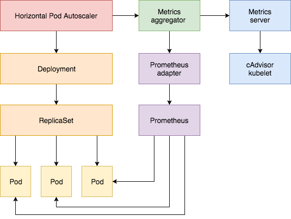
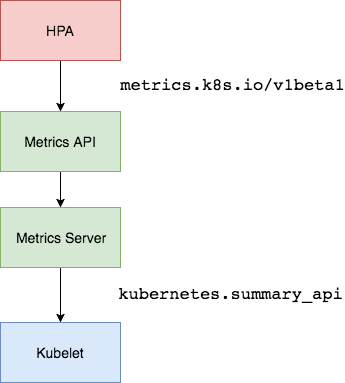
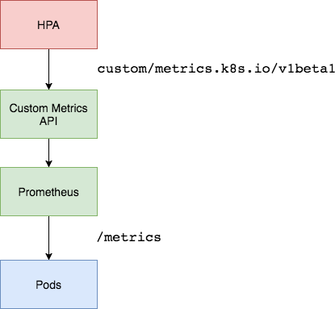

# 监控与HPA

## 一、heapster方式
### 1、说明
```tex
heapster需要搭配 addon-resizer 动态调节 Pod 数量
heapster处于不再维护状态，替代品为metrics-server，此处仅供测试
```
> https://github.com/kubernetes-retired/heapster/blob/master/deploy/kube-config/

* 结构说明

```tex
每个Node上有cAdvisor监控容器状态
heapster从cAdvisor中获取即时信息
influxdb保存heapster中的信息做持久化
grafana从influxdb获取数据做图形展示
```

### 2、部署文件

* influxdb.yaml
```yaml
apiVersion: apps/v1
kind: Deployment
metadata:
  name: monitoring-influxdb
  namespace: kube-system
spec:
  replicas: 1
  selector:
    matchLabels:
      task: monitoring
      k8s-app: influxdb
  template:
    metadata:
      labels:
        task: monitoring
        k8s-app: influxdb
    spec:
      containers:
      - name: influxdb
        image: k8s.gcr.io/heapster-influxdb-amd64:v1.5.2
        volumeMounts:
        - mountPath: /data
          name: influxdb-storage
      volumes:
      - name: influxdb-storage
        emptyDir: {}
---
apiVersion: v1
kind: Service
metadata:
  labels:
    task: monitoring
    # For use as a Cluster add-on (https://github.com/kubernetes/kubernetes/tree/master/cluster/addons)
    # If you are NOT using this as an addon, you should comment out this line.
    kubernetes.io/cluster-service: 'true'
    kubernetes.io/name: monitoring-influxdb
  name: monitoring-influxdb
  namespace: kube-system
spec:
  ports:
  - port: 8086
    targetPort: 8086
  selector:
k8s-app: influxdb
```

* heapster-rbac.yaml
```yaml
kind: ClusterRoleBinding
apiVersion: rbac.authorization.k8s.io/v1beta1
metadata:
  name: heapster
roleRef:
  apiGroup: rbac.authorization.k8s.io
  kind: ClusterRole
  name: system:heapster
subjects:
- kind: ServiceAccount
  name: heapster
namespace: kube-system
```

* heapster.yaml
```yaml
apiVersion: v1
kind: ServiceAccount
metadata:
  name: heapster
  namespace: kube-system
---
apiVersion: apps/v1
kind: Deployment
metadata:
  name: heapster
  namespace: kube-system
spec:
  replicas: 1
  selector:
    matchLabels:
      task: monitoring
      k8s-app: heapster
  template:
    metadata:
      labels:
        task: monitoring
        k8s-app: heapster
    spec:
      serviceAccountName: heapster
      containers:
      - name: heapster
        image: docker.io/anjia0532/google-containers.heapster-amd64:v1.5.4
        imagePullPolicy: IfNotPresent
        command:
        - /heapster
        - --source=kubernetes:https://kubernetes.default
        - --sink=influxdb:http://monitoring-influxdb.kube-system.svc:8086
---
apiVersion: v1
kind: Service
metadata:
  labels:
    task: monitoring
    # For use as a Cluster add-on (https://github.com/kubernetes/kubernetes/tree/master/cluster/addons)
    # If you are NOT using this as an addon, you should comment out this line.
    kubernetes.io/cluster-service: 'true'
    kubernetes.io/name: Heapster
  name: heapster
  namespace: kube-system
spec:
  ports:
  - port: 80
    targetPort: 8082
  selector:
    k8s-app: heapster
```

* grafana.yaml
```yaml
apiVersion: apps/v1
kind: Deployment
metadata:
  name: monitoring-grafana
  namespace: kube-system
spec:
  replicas: 1
  selector:
    matchLabels:
      task: monitoring
      k8s-app: grafana
  template:
    metadata:
      labels:
        task: monitoring
        k8s-app: grafana
    spec:
      containers:
      - name: grafana
        image: docker.io/yuyiyu/google-containers.heapster-grafana-amd64:v5.0.4
        ports:
        - containerPort: 3000
          protocol: TCP
        volumeMounts:
        - mountPath: /etc/ssl/certs
          name: ca-certificates
          readOnly: true
        - mountPath: /var
          name: grafana-storage
        env:
        - name: INFLUXDB_HOST
          value: monitoring-influxdb
        - name: GF_SERVER_HTTP_PORT
          value: "3000"
          # The following env variables are required to make Grafana accessible via
          # the kubernetes api-server proxy. On production clusters, we recommend
          # removing these env variables, setup auth for grafana, and expose the grafana
          # service using a LoadBalancer or a public IP.
        - name: GF_AUTH_BASIC_ENABLED
          value: "false"
        - name: GF_AUTH_ANONYMOUS_ENABLED
          value: "true"
        - name: GF_AUTH_ANONYMOUS_ORG_ROLE
          value: Admin
        - name: GF_SERVER_ROOT_URL
          # If you're only using the API Server proxy, set this value instead:
          # value: /api/v1/namespaces/kube-system/services/monitoring-grafana/proxy
          value: /
      volumes:
      - name: ca-certificates
        hostPath:
          path: /etc/ssl/certs
      - name: grafana-storage
        emptyDir: {}
---
apiVersion: v1
kind: Service
metadata:
  labels:
    # For use as a Cluster add-on (https://github.com/kubernetes/kubernetes/tree/master/cluster/addons)
    # If you are NOT using this as an addon, you should comment out this line.
    kubernetes.io/cluster-service: 'true'
    kubernetes.io/name: monitoring-grafana
  name: monitoring-grafana
  namespace: kube-system
spec:
  # In a production setup, we recommend accessing Grafana through an external Loadbalancer
  # or through a public IP.
  # type: LoadBalancer
  # You could also use NodePort to expose the service at a randomly-generated port
  # type: NodePort
  ports:
  - port: 80
    targetPort: 3000
  selector:
    k8s-app: grafana
  type: NodePort
```

### 3、查看状态
> 访问随机端口即可查看grafana图形界面
> 
> kubectl top pod 和 dashboard 可查看状态

## 二、HPA概述
### 1、HPA结构

* HPA介绍
```
根据API获取资源使用情况，预设资源调节策略，自动调节副本数
动态调节不会很及时，与探测周期相关
探测周期为 kube-controller 启动参数 --horizontal-pod-autoscaler-sync-period 定义 (默认为30s)
```

* K8S监控API
```tex
资源指标: metrics-server
自定义指标: prometheus，k8s-prometheus-adapter

核心指标流水线:
    由kubelet、metrics-server以及由API server提供的api组成
    CPU累积使用率、内存实时使用率、Pod的资源占用率、容器的磁盘占用
监控流水线:
    用于从系统收集各种指标数据并提供终端用户、存储系统及HPA
    包含核心指标及不能被k8s解析的非核心指标
```

### 2、HPA实现方式



#### 2.1、HPA依赖MetricsServer方式



```tex
通过 metrics server 监控系统基础资源并增加对应API
HPA使用API监控系统状态，根据设定规则动态调整副本数
```

#### 2.2、HPA依赖Prometheus方式



```tex
exporter等采集数据
Prometheus存储数据并提供查询接口PromQL
Custom Metrics API通过k8s-prometheus-adapter对接PromQL
HPA通过扩展的API监控系统状态，根据设定规则动态调整副本数
```

## 三、Metrics-server部署
### 1、官方仓库
> https://github.com/kubernetes/kubernetes/tree/master/cluster/addons/metrics-server
```bash
wget https://raw.githubusercontent.com/kubernetes/kubernetes/master/cluster/addons/metrics-server/auth-delegator.yaml
wget https://raw.githubusercontent.com/kubernetes/kubernetes/master/cluster/addons/metrics-server/auth-reader.yaml
wget https://raw.githubusercontent.com/kubernetes/kubernetes/master/cluster/addons/metrics-server/metrics-apiservice.yaml
wget https://raw.githubusercontent.com/kubernetes/kubernetes/master/cluster/addons/metrics-server/metrics-server-deployment.yaml
wget https://raw.githubusercontent.com/kubernetes/kubernetes/master/cluster/addons/metrics-server/metrics-server-service.yaml
wget https://raw.githubusercontent.com/kubernetes/kubernetes/master/cluster/addons/metrics-server/resource-reader.yaml
```

### 2、修改镜像
```yaml
image: yuyiyu/google-containers.metrics-server-amd64:v0.3.3
image: yuyiyu/google-containers.addon-resizer:1.8.5
```

### 3、修改metrics-server

* 修改启动参数
```yaml
command:
- /metrics-server
- --metric-resolution=30s
# These are needed for GKE, which doesn't support secure communication yet.
# Remove these lines for non-GKE clusters, and when GKE supports token-based auth.
- --kubelet-port=10255
- --deprecated-kubelet-completely-insecure=true
- --kubelet-preferred-address-types=InternalIP,Hostname,InternalDNS,ExternalDNS,ExternalIP
```

```yaml
command:
- /metrics-server
- --kubelet-preferred-address-types=InternalIP
- --kubelet-insecure-tls
#- --metric-resolution=30s
# These are needed for GKE, which doesn't support secure communication yet.
# Remove these lines for non-GKE clusters, and when GKE supports token-based auth.
#- --kubelet-port=10255
#- --deprecated-kubelet-completely-insecure=true
#- --kubelet-preferred-address-types=InternalIP,Hostname,InternalDNS,ExternalDNS,ExternalIP
```

* 否则报错
```tex
Flag --deprecated-kubelet-completely-insecure has been deprecated, This is rarely the right option, since it leaves kubelet communication completely insecure.  If you encounter auth errors, make sure you've enabled token webhook auth on the Kubelet, and if you're in a test cluster with self-signed Kubelet certificates, consider using kubelet-insecure-tls instead.
```

### 4、修改metrics-server-nanny

* 修改启动参数
```yaml
command:
  - /pod_nanny
  - --config-dir=/etc/config
  - --cpu={{ base_metrics_server_cpu }}
  - --extra-cpu=0.5m
  - --memory={{ base_metrics_server_memory }}
  - --extra-memory={{ metrics_server_memory_per_node }}Mi
  - --threshold=5
  - --deployment=metrics-server-v0.3.3
  - --container=metrics-server
  - --poll-period=300000
  - --estimator=exponential
  # Specifies the smallest cluster (defined in number of nodes)
  # resources will be scaled to.
  - --minClusterSize={{ metrics_server_min_cluster_size }}
```

```yaml
command:
  - /pod_nanny
  - --config-dir=/etc/config
  # 基础分配的cpu
  - --cpu=100m
  # 每多一个node，会增加分配的cpu
  - --extra-cpu=0.5m
  # 基础分配的内存
  - --memory=40Mi
  # 每多一个node，会增加分配的内存
  - --extra-memory=4Mi
  - --threshold=5
  - --deployment=metrics-server-v0.3.3
  - --container=metrics-server
  - --poll-period=300000
  - --estimator=exponential
  # Specifies the smallest cluster (defined in number of nodes)
  # resources will be scaled to.
  #- --minClusterSize={{ metrics_server_min_cluster_size }}
```
      
* 参数说明
```tex
--config-dir string      Path of configuration containing base resource requirements. (default "MISSING")
--container string       The name of the container to watch. This defaults to the nanny itself. 
--cpu string             The base CPU resource requirement.
--deployment string      The name of the deployment being monitored. This is required.
--estimator string       The estimator to use. Currently supported: linear, exponential (default "linear")
--extra-cpu string       The amount of CPU to add per node.
--extra-memory string    The amount of memory to add per node.
--extra-storage string   The amount of storage to add per node. (default "0Gi")
--memory string          The base memory resource requirement.
--minClusterSize uint    The smallest number of nodes resources will be scaled to. Must be > 1. This flag is used only when an exponential estimator is used. (default 16)
--namespace string       The namespace of the ward. This defaults to the nanny pod's own namespace. 
--pod string             The name of the pod to watch. This defaults to the nanny's own pod. 
--poll-period int        The time, in milliseconds, to poll the dependent container. (default 10000)
--storage string         The base storage resource requirement. (default "MISSING")
--threshold int          A number between 0-100. The dependent's resources are rewritten when they deviate from expected by more than threshold. 
```

* 其他说明
```tex
分配的资源不能太少，且不能超出所在节点的可用资源
```

### 5、添加权限

```yaml
vim resource-reader.yaml
    rules:
    - apiGroups:
      - ""
      resources:
      - pods
      - nodes
      # 添加此资源
      - nodes/stats
      - namespaces
```

* 否则报错
```tex
Forbidden (user=system:serviceaccount:kube-system:metrics-server, verb=get, resource=nodes, subresource=stats)
```

### 6、其他报错
* 可忽略报错，无影响，只是正常打印，但被标注为了ERROR
```tex
    ERROR: logging before flag.Parse: I0830 08:55:01.494675       1 pod_nanny.go:65] Invoked by [/pod_nanny --config-dir=/etc/config --cpu=100m --extra-cpu=0.5m --memory=40Mi --extra-memory=4Mi --threshold=5 --deployment=metrics-server-v0.3.3 --container=metrics-server --poll-period=300000 --estimator=exponential]
    ERROR: logging before flag.Parse: I0830 08:55:01.494748       1 pod_nanny.go:81] Watching namespace: kube-system, pod: metrics-server-v0.3.3-7b797f7888-scs4f, container: metrics-server.
    ERROR: logging before flag.Parse: I0830 08:55:01.494754       1 pod_nanny.go:82] storage: MISSING, extra_storage: 0Gi
    ERROR: logging before flag.Parse: I0830 08:55:01.496078       1 pod_nanny.go:109] cpu: 100m, extra_cpu: 0.5m, memory: 40Mi, extra_memory: 4Mi
    ERROR: logging before flag.Parse: I0830 08:55:01.496093       1 pod_nanny.go:138] Resources: [{Base:{i:{value:100 scale:-3} d:{Dec:<nil>} s:100m Format:DecimalSI} ExtraPerNode:{i:{value:5 scale:-4} d:{Dec:<nil>} s: Format:DecimalSI} Name:cpu} {Base:{i:{value:41943040 scale:0} d:{Dec:<nil>} s: Format:BinarySI} ExtraPerNode:{i:{value:4194304 scale:0} d:{Dec:<nil>} s:4Mi Format:BinarySI} Name:memory}] 
```

* 主机名解析报错
```tex
报错：
    unable to fetch metrics from Kubelet node1 (node1): Get https://node1:10250/stats/summary/

原因：
    采集的目标为主机名，而主机名无法解析

解决：
    kubectl edit configmap coredns -n kube-system
        # proxy同级别添加解析
        hosts {
           192.168.61.11 node1
           192.168.61.12 node2
           fallthrough
        }
```

### 7、验证
> 需要等待一段时间系统才会采集数据

* 查看节点资源

```bash
kubectl top nodes 
    NAME      CPU(cores)   CPU%   MEMORY(bytes)   MEMORY%   
    centos1   135m         6%     864Mi           23%       
    centos2   42m          2%     401Mi           10%       
    centos3   41m          2%     480Mi           13%     
```

* 查看Pod资源

```bash
kubectl top pod --all-namespaces 
    NAMESPACE       NAME                                        CPU(cores)   MEMORY(bytes)   
    default         busybox                                     0m           0Mi             
    ingress-nginx   nginx-ingress-controller-79f6884cf6-w9kpv   2m           105Mi           
    kube-system     canal-7d6qg                                 12m          37Mi            
    kube-system     canal-fk2jz                                 22m          36Mi            
    kube-system     canal-xz45r                                 12m          38Mi   
```

     
* metrics-server提供的api

```bash
kubectl api-version
    metrics.k8s.io/v1beta1
```

* curl查看相关API
```bash
curl http://localhost:50001/apis/metrics.k8s.io/v1beta1
{
  "kind": "APIResourceList",
  "apiVersion": "v1",
  "groupVersion": "metrics.k8s.io/v1beta1",
  "resources": [
    {
      "name": "nodes",
      "singularName": "",
      "namespaced": false,
      "kind": "NodeMetrics",
      "verbs": [
        "get",
        "list"
      ]
    },
    {
      "name": "pods",
      "singularName": "",
      "namespaced": true,
      "kind": "PodMetrics",
      "verbs": [
        "get",
        "list"
      ]
    }
  ]
```

## 四、依赖metrics-server的HPA测试
### 1、测试deployment

* php-apache-dep.yaml 
```yaml
apiVersion: apps/v1
kind: Deployment
metadata:
  name: php-apache
  labels:
    app: php-apache
spec:
  replicas: 1
  selector:
    matchLabels:
      app: php-apache
  template:
    metadata:
      name: php-apache
      labels:
        app: php-apache
    spec:
      containers:
      - name: php-apache
        image: docker.io/yuyiyu/google-containers.hpa-example
        resources:
          requests:
            cpu: 100m
          limits:
            cpu: 200m
        ports:
        - containerPort: 80
---
apiVersion: v1
kind: Service
metadata:
  name: php-apache
spec:
  ports:
  - port: 80
  selector:
    app: php-apache
```

### 2、HPA规则

* hpa-php-apache.yaml
```yaml
apiVersion: autoscaling/v1
kind: HorizontalPodAutoscaler
metadata:
  name: php-apache
spec:
  scaleTargetRef:
    apiVersion: apps/v1
    kind: Deployment
    name: php-apache
  # 限定副本数量在1到4之间调整
  minReplicas: 1
  maxReplicas: 4
  # 规定平均Pod的CPU使用率维持在50%
  targetCPUUtilizationPercentage: 50
```

### 3、测试

* 压测
```bash
while true; do wget -q -O- http://[php_apache_IP] > /dev/null; done
```

```tex
一段探测周期后，副本数增加到4
释放测试命令后，副本数恢复为1
```

* 查看状态

```bash
kubectl get hpa;
    NAME         REFERENCE               TARGETS   MINPODS   MAXPODS   REPLICAS   AGE
    php-apache   Deployment/php-apache   70%/50%   1         4         4          9m1s

kubectl top node
    NAME      CPU(cores)   CPU%   MEMORY(bytes)   MEMORY%   
    centos1   166m         8%     830Mi           30%       
    centos2   429m         21%    483Mi           13%       
    centos3   167m         8%     797Mi           21%
     
kubectl get deployments.apps php-apache
    NAME         READY   UP-TO-DATE   AVAILABLE   AGE
    php-apache   4/4     4            4           15m
```

```bash
kubectl get hpa
    NAME         REFERENCE               TARGETS   MINPODS   MAXPODS   REPLICAS   AGE
    php-apache   Deployment/php-apache   1%/50%    1         4         1          15m

kubectl top node
    NAME      CPU(cores)   CPU%   MEMORY(bytes)   MEMORY%   
    centos1   182m         9%     829Mi           30%       
    centos2   170m         8%     470Mi           12%       
    centos3   127m         6%     590Mi           16%       

kubectl get deployments.apps php-apache 
    NAME         READY   UP-TO-DATE   AVAILABLE   AGE
    php-apache   1/1     1            1           22m
```

## 五、Prometheus部署

### 1、部署方式
```tex
K8S仓库中部署测试级Prometheus
    https://github.com/kubernetes/kubernetes/tree/master/cluster/addons/prometheus

官方推荐的企业级Prometheus
    https://github.com/coreos/prometheus-operator
```

### 2、K8S仓库中部署测试级Prometheus
#### 2.1、修改配置文件
```tex
修改镜像
    image: yuyiyu/google-containers.addon-resizer:1.8.5

添加暴露Prometheus端口，用于调试
    type: NodePort

修改PVC
    根据情况修改磁盘空间大小
    storageClassName: alert
    storageClassName: prometheus
```

#### 2.2、创建两个PV

* 对应alert的PVC
```yaml
apiVersion: v1 
  kind: PersistentVolume 
  metadata: 
    name: nfs-pv-alert
  spec: 
    capacity: 
      storage: 4Gi 
    volumeMode: Filesystem 
    accessModes: 
    - ReadWriteOnce 
    persistentVolumeReclaimPolicy: Recycle 
    storageClassName: alert
    nfs:
      path: /data/nfs
      server: 192.168.112.172
```

* 对应Prometheus的PVC
```yaml
apiVersion: v1 
kind: PersistentVolume 
metadata: 
  name: nfs-pv-pro
spec: 
  capacity: 
    storage: 14Gi 
  volumeMode: Filesystem 
  accessModes: 
  - ReadWriteOnce 
  persistentVolumeReclaimPolicy: Recycle 
  storageClassName: prometheus
  nfs:
    path: /data/nfs
    server: 192.168.112.172
```

* grafana.yaml

> https://github.com/kubernetes-retired/heapster/blob/master/deploy/kube-config/influxdb/grafana.yaml
> 
> grafana设置Prometheus源 http://prometheus.namespace.svc:9090/
> 
> grafana官方站点下载面板Kubernetes Cluster (Prometheus)
```yaml
apiVersion: apps/v1
kind: Deployment
metadata:
  name: monitoring-grafana
  namespace: kube-system
spec:
  replicas: 1
  selector:
    matchLabels:
      task: monitoring
      k8s-app: grafana
  template:
    metadata:
      labels:
        task: monitoring
        k8s-app: grafana
    spec:
      containers:
      - name: grafana
        image: docker.io/yuyiyu/google-containers.heapster-grafana-amd64:v5.0.4
        ports:
        - containerPort: 3000
          protocol: TCP
        volumeMounts:
        - mountPath: /etc/ssl/certs
          name: ca-certificates
          readOnly: true
        - mountPath: /var
          name: grafana-storage
        env:
        # 注释influxdb环境变量
        #- name: INFLUXDB_HOST
        #  value: monitoring-influxdb
        - name: GF_SERVER_HTTP_PORT
          value: "3000"
          # The following env variables are required to make Grafana accessible via
          # the kubernetes api-server proxy. On production clusters, we recommend
          # removing these env variables, setup auth for grafana, and expose the grafana
          # service using a LoadBalancer or a public IP.
        - name: GF_AUTH_BASIC_ENABLED
          value: "false"
        - name: GF_AUTH_ANONYMOUS_ENABLED
          value: "true"
        - name: GF_AUTH_ANONYMOUS_ORG_ROLE
          value: Admin
        - name: GF_SERVER_ROOT_URL
          # If you're only using the API Server proxy, set this value instead:
          # value: /api/v1/namespaces/kube-system/services/monitoring-grafana/proxy
          value: /
      volumes:
      - name: ca-certificates
        hostPath:
          path: /etc/ssl/certs
      - name: grafana-storage
        emptyDir: {}
---
apiVersion: v1
kind: Service
metadata:
  labels:
    # For use as a Cluster add-on (https://github.com/kubernetes/kubernetes/tree/master/cluster/addons)
    # If you are NOT using this as an addon, you should comment out this line.
    kubernetes.io/cluster-service: 'true'
    kubernetes.io/name: monitoring-grafana
  name: monitoring-grafana
  namespace: kube-system
spec:
  # In a production setup, we recommend accessing Grafana through an external Loadbalancer
  # or through a public IP.
  # type: LoadBalancer
  # You could also use NodePort to expose the service at a randomly-generated port
  # type: NodePort
  ports:
  - port: 80
    targetPort: 3000
    nodePort: 30006
  selector:
    k8s-app: grafana
  type: NodePort
```

### 3、k8s-prometheus-adapter
> https://github.com/DirectXMan12/k8s-prometheus-adapter/tree/master/deploy/manifests

#### 3.1、准备证书，用于https访问api-server
* 通过 custom-metrics-apiserver-deployment.yaml 查看使用的证书名称

```yaml
namespace: custom-metrics

volumes:
- name: volume-serving-cert
  secret:
    secretName: cm-adapter-serving-certs
```

* 创建证书

```
(umask 077;openssl genrsa -out serving.key 2048)

openssl req -new -key serving.key -out serving.csr -subj "/CN=serving"

openssl x509 -req -in serving.csr -CA ./ca.crt -CAkey ./ca.key -CAcreateserial -out serving.crt -days 3650

kubectl create namespace custom-metrics

kubectl create secret generic cm-adapter-serving-certs --from-file=serving.crt=./serving.crt --from-file=serving.key=./serving.key -n kube-system
```

#### 3.2、修改配置文件
> 指定Prometheus地址
```yaml
- --prometheus-url=http://prometheus.kube-system.svc:9090/
```

#### 3.3、创建完成后有新的api-version
```yaml
custom.metrics.k8s.io/v1beta1
```

#### 3.4、权限绑定错误
```tex
User "system:serviceaccount:custom-metrics:custom-metrics-apiserver" cannot list resource "nodes" in API group "" at the cluster scope
```


