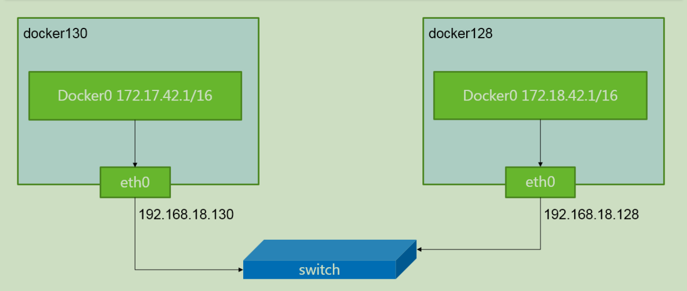

# 一、容器网络方案：

* 隧道方案（ Overlay Networking ）
>隧道方案在IaaS层的网络中应用也比较多，大家共识是随着节点规模的增长复杂度会提升，而且出了网络问题跟踪起来比较麻烦，大规模集群情况下这是需要考虑的一个点。
```
Weave：UDP广播，本机建立新的BR，通过PCAP互通
Open vSwitch（OVS）：基于VxLan和GRE协议，但是性能方面损失比较严重
Flannel：UDP广播，VxLan
Racher：IPsec
```

* 路由方案
>路由方案一般是从3层或者2层实现隔离和跨主机容器互通的，出了问题也很容易排查。
```
Calico：基于BGP协议的路由方案，支持很细致的ACL控制，对混合云亲和度比较高。
Macvlan：从逻辑和Kernel层来看隔离性和性能最优的方案，基于二层隔离，所以需要二层路由器支持，大多数云服务商不支持，所以混合云上比较难以实现。
```

# 二、网络管理规范
* CNM（Docker LibnetworkContainer Network Model）:
>Docker Libnetwork的优势就是原生，而且和Docker容器生命周期结合紧密；缺点也可以理解为是原生，被Docker“绑架”。
```
Docker Swarm overlay
Macvlan & IP networkdrivers
Calico
Contiv
Weave
```

* CNI（Container NetworkInterface）：
>CNI的优势是兼容其他容器技术（e.g. rkt）及上层编排系统（Kubernetes & Mesos)，而且社区活跃势头迅猛，Kubernetes加上CoreOS主推；缺点是非Docker原生。
```
Kubernetes
Weave
Macvlan
Calico
Flannel
Contiv
Mesos CNI
```

# 三、Flannel网络原理


>通过修改docker启动项，给每个节点的docker分配相互不想冲突的IP地址
>
>给这些IP地址之间建立一个覆盖网络，同过覆盖网络，将数据包原封不动的传递到目标容器内
>
>属于覆盖网络overlaynetwork的一种



# 四、Flannel实现过程参照二进制安装
