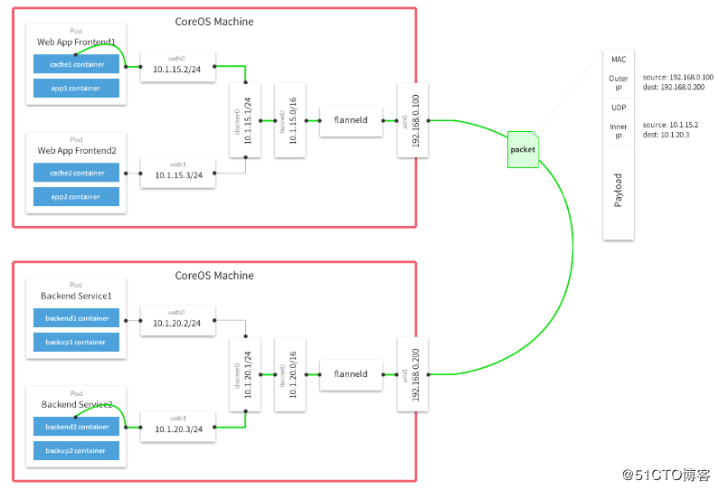
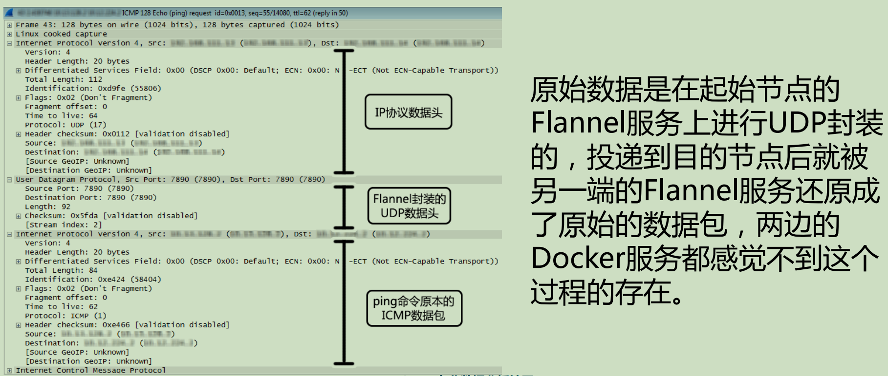
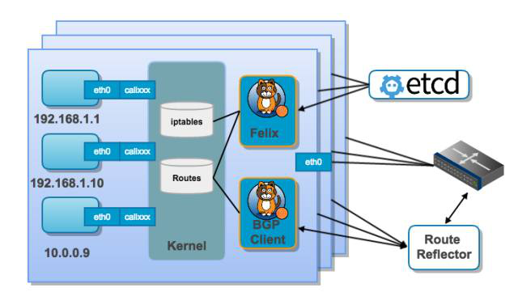
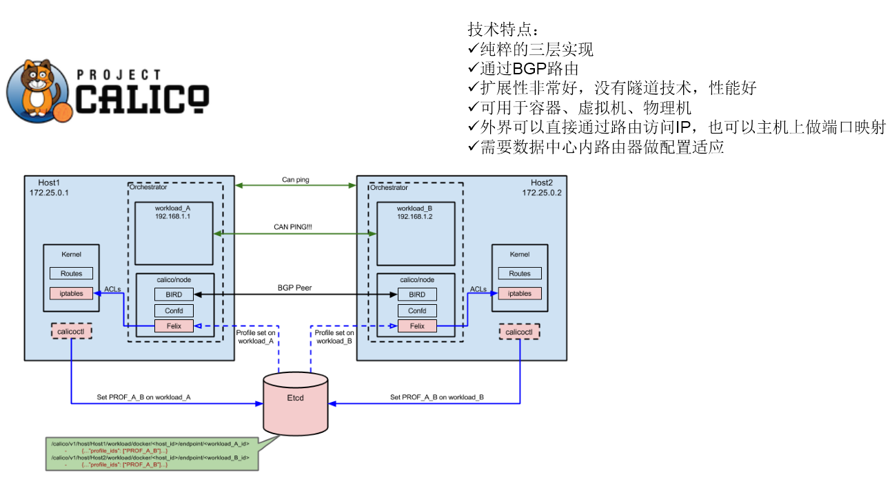

# 一、容器网络方案：

* 隧道方案（ Overlay Networking ）
>隧道方案在IaaS层的网络中应用也比较多，大家共识是随着节点规模的增长复杂度会提升，而且出了网络问题跟踪起来比较麻烦，大规模集群情况下这是需要考虑的一个点。
```
Weave：UDP广播，本机建立新的BR，通过PCAP互通
Open vSwitch（OVS）：基于VxLan和GRE协议，但是性能方面损失比较严重
Flannel：UDP广播，VxLan
Racher：IPsec
```

* 路由方案
>路由方案一般是从3层或者2层实现隔离和跨主机容器互通的，出了问题也很容易排查。
```
Calico：基于BGP协议的路由方案，支持很细致的ACL控制，对混合云亲和度比较高。
Macvlan：从逻辑和Kernel层来看隔离性和性能最优的方案，基于二层隔离，所以需要二层路由器支持，大多数云服务商不支持，所以混合云上比较难以实现。
```

# 二、网络管理规范
* CNM（Docker LibnetworkContainer Network Model）:
>Docker Libnetwork的优势就是原生，而且和Docker容器生命周期结合紧密；缺点也可以理解为是原生，被Docker“绑架”。
```
Docker Swarm overlay
Macvlan & IP networkdrivers
Calico
Contiv
Weave
```

* CNI（Container NetworkInterface）：
>CNI的优势是兼容其他容器技术（e.g. rkt）及上层编排系统（Kubernetes & Mesos)，而且社区活跃势头迅猛，Kubernetes加上CoreOS主推；缺点是非Docker原生。
```
Kubernetes
Weave
Macvlan
Calico
Flannel
Contiv
Mesos CNI
```

# 三、Flannel网络

>通过修改docker启动项，给每个节点的docker分配相互不想冲突的IP地址
>
>给这些IP地址之间建立一个覆盖网络，同过覆盖网络，将数据包原封不动的传递到目标容器内
>
>每台主机一个CIDR，三层互通，属于覆盖网络overlaynetwork的一种



>Flannel实现过程参照二进制安装

# 四、Calico网络

## 1、结构说明
* Felix，Calico Agent
>跑在每台需要运行Workload的节点上，主要负责配置路由及ACLs等信息来确保Endpoint的连通状态
* etcd
>分布式键值存储，主要负责网络元数据一致性，确保Calico网络状态的准确性
* BGP Client(BIRD)
>主要负责把Felix写入Kernel的路由信息分发到当前Calico网络，确保Workload间的通信的有效性
* BGP Route Reflector(BIRD)
>大规模部署时使用，摒弃所有节点互联的 mesh 模式，通过一个或者多个BGP Route Reflector来完成集中式的路由分发



## 2、安装过程
> https://docs.projectcalico.org/v3.8/getting-started/kubernetes/installation/other

* 使用方式
```
1、calico为网络和网络策略
2、flannel为网络及calico为网络策略
3、仅安装calico网络策略
```

* 安装方式
```
1、依赖api-server，然后联系etcd运转
2、另起一套etcd，联系etcd运转
```

## 3、网络策略写法

* kubectl explain networkpolicy

```tex
KIND:     NetworkPolicy
VERSION:  extensions/v1beta1

apiVersion	<string>
kind	<string>
metadata	<Object>

spec	<Object>
    egress	<[]Object>          出栈规则
        ports	<[]Object>          目标端口列表
            port	<string>
            protocol	<string>

        to	<[]Object>              目标地址
            ipBlock	<Object>

            namespaceSelector	<Object>

            podSelector	<Object>

    ingress	<[]Object>          入栈规则
        ports	<[]Object>          源端口列表
            port	<string>
            protocol	<string>

        from	<[]Object>              源地址
            ipBlock	<Object>                ip段

            namespaceSelector	<Object>

            podSelector	<Object>

    podSelector	<Object> -required-     应用的Pod

    policyTypes	<[]string>      使用入栈或出栈，或二者都使用
        Ingress, Egress, or Ingress,Egress
        如果只定义了Ingress，而policyTypes选择Ingress,Egress，
        则会应用默认的Egress规则
```

## 4、网络策略测试
### 4.1、规则设置
> 禁止所有访问

* ingress-def.yaml
```
apiVersion: extensions/v1beta1
kind: NetworkPolicy
metadata:
    name: deny-all-ingress
spec:
    podSelector: {}             # 空代表选择所有
    policyTypes:
    - Ingress
```

### 4.2、创建namespace并应用规则
```
kubectl create namespace dev
kubectl create namespace prod

# -n dev 指定创建在dev名称空间中生效
kubectl apply -f ingress-def.yaml -n dev
```

### 4.3、测试容器

* myapp.yaml
```yaml
apiVersion: v1
kind: Pod
metadata:
  name: pod1
spec:
  containers:
  - name: myapp
    image: ikubernetes/myapp:v1
```

```bash
kubectl create -f myapp.yaml -n dev
kubectl create -f myapp.yaml -n prod
```

> curl访问Pod地址时，dev的不能访问，prod可以访问

### 4.4、错误处理
> calico 有些版本缺失 BGPC 配置，需要另行创建
```yaml
apiVersion: apiextensions.k8s.io/v1beta1
kind: CustomResourceDefinition
metadata:
  name: bgppeers.crd.projectcalico.org
spec:
  scope: Cluster
  group: crd.projectcalico.org
  version: v1
  names:
    kind: BGPPeer
    plural: bgppeers
    singular: bgppeer
```


