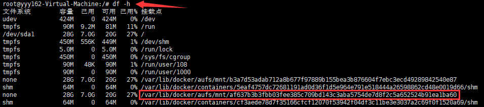
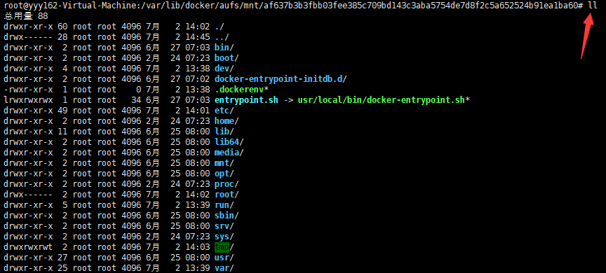
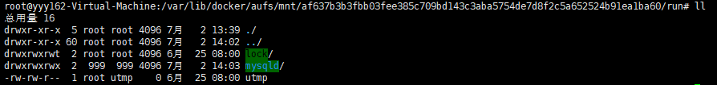
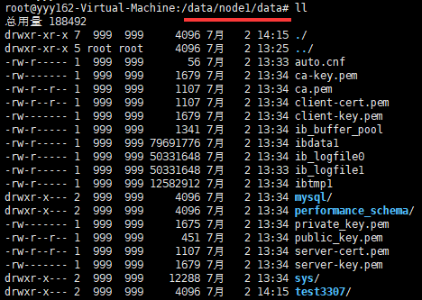
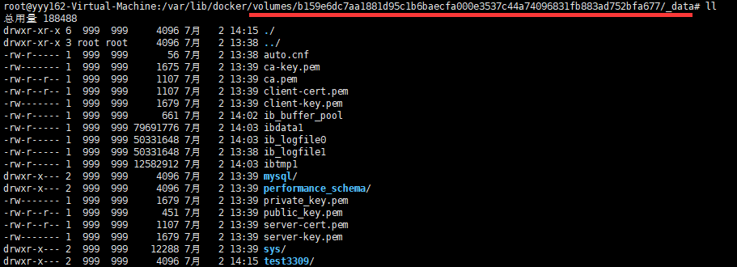
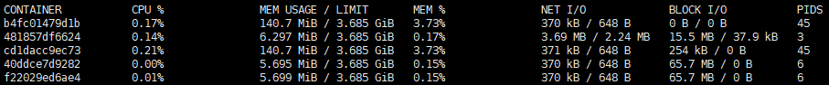
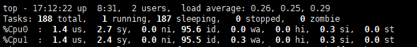
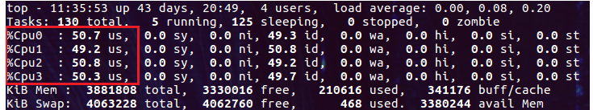
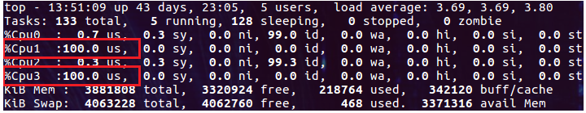
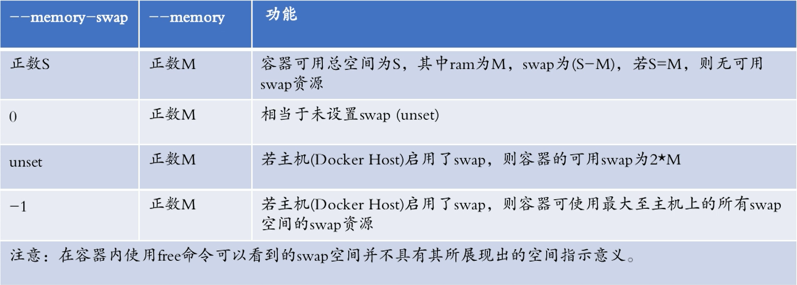

# 一、安装

* centos

```
1、必须是64位操作系统，建议内核在 3.8 以上
uname -r

2、对于CentOS 6.9而言，可通过以下命令安装最新内核：
rpm --import https://www.elrepo.org/RPM-GPG-KEY-elrepo.org
rpm -ivh http://www.elrepo.org/elrepo-release-6-8.el6.elrepo.noarch.rpm
yum -y --enablerepo=elrepo-kernel install kernel-lt

3、设置默认启动内核
vim /etc/grub.conf
将default=1修改为default=0

4、安装docker
https://docs.docker.com/install/linux/docker-ce/centos/
```

* ubuntu
```
https://docs.docker.com/install/linux/docker-ce/ubuntu/#set-up-the-repository
```

* docker版本
```
2013年    开源 
2015年    V1.5、V1.6、V1.7、V1.8、V1.9
2016年    V1.10、V1.11、V1.12
2017年    V1.13

之后变更命名规则    V年份.月份.小版本
比如 Docker 在2017年3月的这次更新, 新的版本号变成了 V17.03.0-ce
```

* 修改默认网段与镜像源
>vim /etc/docker/daemon.json
```
{
    "bip": "10.1.10.1/24",
    "registry-mirrors": ["https://registry.docker-cn.com"]
}
```

# 二、docker与linux的关系
## 1、LXC
```
LinuX Container，基于容器的操作系统层级的虚拟化
共享宿主机资源和内核，使用namespace和cgroups对资源限制与隔离

docker是LXC的封装实现，底层依靠LXC提供的API工具
```

## 2、Namespaces
```
命名空间
Linux内核提供的一种限制单进程或者多进程资源隔离机制
一个进程可以属于多个命名空间
```

| namespace | 系统调用参数  | 隔离内容 |
| --- | --- | --- |
| UTS  | CLONE_NEWUTS | 主机名和域名 |
| IPC |  CLONE_NEWIPC  | 信号量、消息队列和共享内存 |
| PID  |  CLONE_NEWPID |进程编号  |
|Network  | CLONE_NEWNET  | 网络设备、网络栈、端口等 |
| Mount  |CLONE_NEWNS   | 文件系统 |
| User  | CLONE_NEWUSER |  用户和用户组|

## 3、Cgroups
```
control groups
Linux内核提供的一种限制单进程或者多进程资源的机制
比如CPU、内存，磁盘等资源的使用限制
```

## 4、docker文件系统

* UFS
```
UnionFS
联合文件系统
支持将不同位置的目录挂载到同一虚拟文件系统，形成一种分层的模型
成员目录称为虚拟文件系统的一个分支（branch）
```

* AUFS
```
advanced multi layered unification filesystem
高级多层统一文件系统，是UFS的一种
每个branch可以指定readonly（ro只读）、readwrite（读写）和whiteout-able（wo隐藏）权限
一般情况下，aufs只有最上层的branch才有读写权限，其他branch均为只读权限
如果有多个镜像使用CentOS镜像，那么只需要创建一个系统层，节省存储和内存
```

* docker info
```
Ubuntu追求激进，使用aufs
    Storage Driver: aufs
        Backing Filesystem: extfs

Centos追求稳定，使用overlay2
    Storage Driver: overlay2
        Backing Filesystem: xfs
```

# 三、docker目录对应
>一个镜像会有若干个层组成
>
>在建立镜像时，每次写操作，都被视作一种增量操作，即在原有的数据层上添加一个新层
>
>每次commit提交就会对产生一个ID，就相当于在上一层有加了一层，可以通过这个ID对镜像回滚
```
/var/lib/docker/aufs/diff
    每层与其父层之间的文件差异
    
/var/lib/docker/aufs/layers/
    每层一个文件，记录其父层一直到根层之间的ID
    大部分文件的最后一行都已，表示继 承来自同一层
    
/var/lib/docker/aufs/mnt
    联合挂载点，从只读层复制到最上层可读写层的文件系统数据
```

## 1、查看挂载信息


## 2、目录对应
>在每个 /var/lib/docker/containers/container-id 上面的 /var/lib/docker/aufs/mnt/ 为对应容器的文件系统
>
>大多数文件的映射关系一致，且操作的是同一文件



## 3、run目录的映射
>运行目录 docker 中的 /var/run 映射为外层的 /run



## 4、对于数据库，/var/lib/mysql
* 如果创建时指定了 -v ，目录会直接关联


* 如果创建时未指定 -v ，会自动生成到 /var/lib/docker/volumes 中



# 四、docker命令
## 1、命令总览
>新版的docker命令将资源分组，但可以兼容老版的命令
```
builder     Manage builds
config      Manage Docker configs
container   Manage containers
engine      Manage the docker engine
image       Manage images
network     Manage networks
node        Manage Swarm nodes
plugin      Manage plugins
secret      Manage Docker secrets
service     Manage services
stack       Manage Docker stacks
swarm       Manage Swarm
system      Manage Docker
trust       Manage trust on Docker images
volume      Manage volumes
```

## 2、常用命令


```
# 查看Docker版本
docker version

# 从Docker文件构建Docker映像
docker build -t image-name docker-file-location
    -t：它用于指定使用提供的名称来标记Docker映像
    
# 运行Docker映像
docker run -d image-name
    -d：用于创建守护程序进程
    
# 停止运行容器
docker stop container_id
```

```
# 查看可用的Docker映像
docker images

# 查看最近的运行容器
docker ps -l
    -l：它用于显示最新的可用容器

# 查看所有正在运行的容器
docker ps -a --no-trunc
    -a：它用于显示所有可用的容器
    --no-trunc：让command显示完整
```

```
# 删除一个映像
docker rmi image-name

# 删除所有映像
docker rmi $(docker images -q)

# 强制删除所有映像
docker rmi -r $(docker images -q)

# 删除所有容器
docker rm $(docker ps -a -q)
```

```
# 进入Docker容器
docker exec -it container-id bash
docker attach container-id
```

```
# 查看容器的配置信息
docker inspect container-id

# 查看容器的日志
docker logs -f mysql1

# 查看容器内应用的进程信息
docker top mysql1
```

```
# 导出镜像
docker save 镜像ID > tomcat8.tar

# 导入镜像
docker load -i tomcat8.tar

# 导出容器
docker export 容器ID > mymysql.tar

# 导入容器到镜像
cat mymysql.tar | docker import - 镜像名:版本
# 之后还要创建，才有容器
docker run --name 容器名称 -idt 镜像名:版本 [启动命令]
```

```
# 动态修改容器的一些配置，如资源限制参数等
docker update --help

# 查看docker的事件，如启动关闭容器、镜像下载等
docker events --help
```

## 3、run/create命令选项
```
-i, --interactive
    使容器可交互
-t, --tty
    分配伪终端
-d, --detach
    在后台运行

--add-host list
    增加host文件条目，以"主机名:IP"形式
--link list
    将其他容器的主机名和IP，添加到当前容器的hosts文件中

--cap-add list
--cap-drop list
    增加和取消权限，比如ntp服务，需要修改Linux内核，必须赋予对应权限
--privileged=false
    指定容器是否为特权容器，特权容器拥有所有的capabilities

--cidfile string
    将容器的pid输出到指定文件中，用于审计

--device list
    添加宿主机的设备到容器
--mount mount
    挂载宿主机的分区到容器

--dns list
    配置容器的dns
-e, --env list
    配置容器的环境变量
--env-file list
    指定环境变量的配置文件
-h, --hostname string
    指定主机名，默认为容器id的一部分
--ip string
    指定IP地址，必须是自定义网络
--network string
    指定使用的docker已有网络{NET_NAME}，默认为default网络
    docker network create --subnet={NET_SEGMENT} {NET_NAME}

--log-driver
    指定容器的标准输出日志方式
    none、json-file、syslog、fluentd、splunk等
    json-file   默认存储在/var/lib/docker/containers/ID/ID-json.log
    none        不输出日志
    syslog      输出到容器的系统日志中 
--log-opt
    日志输出方式的补充选项

--oom-kill-disable
    不让系统kill此容器

--pid string

--restart
    no              默认不重启
    on-failure:3    指定容器非正常关闭后，自动重启3次

--ulimit ulimit
    指定文件描述符
    多个时格式
        --ulimit nproc=10240 --ulimit nofile=10240
    
-w, --workdir string
    进入容器后的工作目录
```

# 五、常规用法

## 1、inspect 查看容器或镜像的信息

> docker inspect  container_id
```
[
    {
        "Id": "cad57eb71d60903161a3c77be75afc2a50b0edc098988e02cef63dc1f33a8354",
        "Created": "2018-12-06T03:08:47.079308674Z",
        "Path": "nginx",
        "Args": [
            "-g",
            "daemon off;"
        ],
        "State": {
            "Status": "running",
            "Running": true,
            "Paused": false,
            "Restarting": false,
            "OOMKilled": false,
            "Dead": false,
            "Pid": 4538,
            "ExitCode": 0,
            "Error": "",
            "StartedAt": "2018-12-06T03:08:47.530880424Z",
            "FinishedAt": "0001-01-01T00:00:00Z"
        },
        ...
    }
]
```
* 查看单个配置项
> docker inspect -f '{{.State.Pid}}' container_id
>>4538

* 查看文件系统的挂载位置
> docker inspect -f '{{.GraphDriver.Data.MergedDir}}' container_id
>>/var/lib/docker/overlay2/f7d4dc765134f9255dbe5fee8cc2775f6ee8f00ad2c35460afd631a865b9bceb/merged

* 查看网卡MAC
```
[
    {
        "NetworkSettings": {
            "Networks": {
                "bridge": {
                    "MacAddress": "02:42:ac:11:00:02",
                }
            }
        }
    }
]
```
>docker inspect -f {{.NetworkSettings.Networks.bridge.MacAddress}} nginx1
>>02:42:ac:11:00:02

## 2、cp 主机与容器间文件传输

```
1、拿到容器的短ID或name
docker ps -a

2、根据上步获取ID全称
# docker inspect -f '{{.Id}}' mysql1
fdsgsd4353gdsgfdf3543

3、本机传递到容器中
docker cp 本地文件路径 ID全称:容器路径

4、容器传递到本机中
docker cp ID全称:容器文件路径 本地路径
```

## 3、上传自定义镜像
### a、将容器提交为本地镜像
```
docker commit 容器id 自定义镜像名称
```

```
-a, --author string    添加作者，"名字<邮箱>"
-c, --change list      添加Dockerfile指令，例如'CMD ["/bin/httpd","-f"]'
-m, --message string   添加提交信息
-p, --pause            提交时暂停容器
```

### b、将本地镜像打标签
```
# 这里的tag不指定就是latest
docker tag <existing-image> <hub-user>/<repo-name>[:<tag>]
```

### c、登陆自己的dockerhup
```
docker login
```

### d、推送自定义的镜像
```
# 必须先在自己的网页中，建立仓库
docker push <hub-user>/<repo-name>:<tag>
```

### e、commit命令
>docker container commit --help

## 4、查看环境变量
### a、查看镜像的环境变量
>docker run -it mysql:5.7 env
```
HOSTNAME=2721cf7cd8f7
PWD=/
HOME=/root
MYSQL_MAJOR=5.7
GOSU_VERSION=1.7
MYSQL_VERSION=5.7.24-1debian9
TERM=xterm
SHLVL=0
PATH=/usr/local/sbin:/usr/local/bin:/usr/sbin:/usr/bin:/sbin:/bin
```

### b、查看容器的环境变量
>docker exec mysql1 env
```
PATH=/usr/local/sbin:/usr/local/bin:/usr/sbin:/usr/bin:/sbin:/bin
HOSTNAME=7ca2619fa428
MYSQL_ROOT_PASSWORD=root
GOSU_VERSION=1.7
MYSQL_MAJOR=5.7
MYSQL_VERSION=5.7.24-1debian9
HOME=/root
```

# 六、资源限制
## 1、查看容器硬件状态
>docker stats nginx1
>
>--no-stream 只打印一次，而不交互

```
CONTAINER ID    NAME    CPU %   MEM USAGE / LIMIT   MEM %   NET I/O         BLOCK I/O   PIDS
2566f0aedb1e    nginx2  0.00%   2.18MiB / 100MiB    2.18%   3.27kB / 0B     0B / 0B     2
```

```
# 容器的cpu状态在宿主机上的位置
/sys/fs/cgroup/cpuset/docker/<container_id>

# 容器的内存状态在宿主机上的位置
/sys/fs/cgroup/memory/docker/<container_id>

# 容器的磁盘状态在宿主机上的位置
/sys/fs/cgroup/blkio/docker/<container_id>
```

## 2、压力测试镜像

> https://hub.docker.com/r/lorel/docker-stress-ng


## 3、限制CPU
### a、查看容器资源状态
```
docker stats
```


### b、查看多核的cpu情况

```
top 命令后 按1
```


### c、分配docker可用的cpu百分比
```
docker run -p 50001:80 --name nginx1 --cpus=2 -d nginx
```

```
--cpus=2
	限定cpu负载最多200%
	如果宿主机为4核，负载是均摊的
```


### d、指定固定的CPU
```
docker run -p 50001:80 --name nginx1 --cpuset-cpus="1" -d nginx
```

```
--cpuset-cpus="1,3"
	分配编号为1和3的CPU给容器
	不会使用其他编号的CPU
```


### e、设置CPU权重
```
docker run -p 50002:80 --name nginx2 --cpuset-cpus="0" --cpu-shares=512 --cpuset-cpus="1" --cpu-shares=1024   -d nginx
```

```
--cpuset-cpus="0" --cpu-shares=512 
--cpuset-cpus="1" --cpu-shares=1024
	设置容器以 512:1024 的比值使用 CPU
	权重取值范围为 1-1024，0 代表 1024
```

## 4、限制内存
>docker run --name nginx2 -m 100m -d nginx
```
单位 b、k、m、g，分别对应 bytes、KB、MB、和 GB
超过上限将触发oom来kill容器，不要使用swap
docker daemon 的OOM优先级已被调整，防止被内核kill
```


## 5、限制IO
```
--device-read-bps
限制此设备上的读速度（bytes per second），单位可以是kb、mb或者gb

--device-read-iops
通过每秒读IO次数来限制指定设备的读速度。

--device-write-bps
限制此设备上的写速度（bytes per second），单位可以是kb、mb或者gb

--device-write-iops
通过每秒写IO次数来限制指定设备的写速度

--blkio-weight
容器默认磁盘IO的加权值，有效值范围为10-1000
如果两个容器同时使用磁盘IO，将根据加权值分配IO宽度

--blkio-weight-device
针对特定设备的IO加权控制，其格式为DEVICE_NAME:WEIGHT
```

# 七、垃圾清理
## 1、容器

```
# 删除停止中的容器
# 会提示是否继续，加 -f 将不会有提示
docker container prune

# 可以添加过滤 --filter
# 例如，删除停止超过24小时的容器
docker container prune --filter "until=24h"
```

## 2、镜像

```
# 删除状态为 dangling 的镜像
# 会提示是否继续，加 -f 将不会有提示
docker image prune

# 删除未使用的镜像
# 会提示是否继续，加 -f 将不会有提示
docker image prune -a

# 可以添加过滤 --filter
# 例如，删除停止使用超过24小时的镜像
docker image prune --filter "until=24h"
```

## 3、存储卷

```
# 存储卷可以被一个或者多个容器使用，也会占据磁盘空间
# 为保持数据，存储卷永远都不会自动被删除

# 删除多余的存储卷
# 会提示是否继续，加 -f 将不会有提示
docker volume prune

# 可以添加过滤 --filter
# 例如，删除label值不为keep的存储卷
docker volume prune --filter "label!=keep"
```

## 4、网络

```
# docker网络并不会占据磁盘空间
# 但是会创建iptables规则，桥网络设备和路由表

# 删除多余的网络
# 会提示是否继续，加 -f 将不会有提示
docker network prune

# 可以添加过滤 --filter
# 例如，删除未被使用超过24小时的网络
docker volume prune --filter "until=24h"
```

## 5、删除所有的对象

```
 $ docker system prune

 WARNING! This will remove:
         - all stopped containers
         - all networks not used by at least one container
         - all dangling images
         - all build cache

 Are you sure you want to continue? [y/N] y
```

* 如果所使用的docker 17.06.1之后的版本，则需要在命令后添加–volumes字段来清理存储卷的内容

```
 $ docker system prune --volumes

 WARNING! This will remove:
         - all stopped containers
         - all networks not used by at least one container
         - all volumes not used by at least one container
         - all dangling images
         - all build cache

 Are you sure you want to continue? [y/N] y
```
