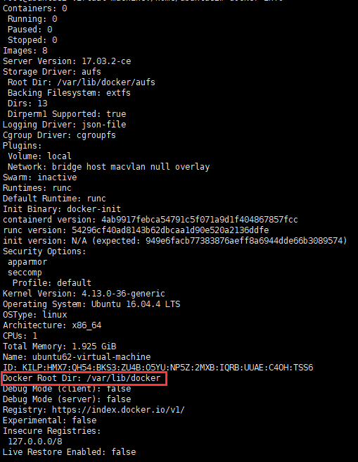
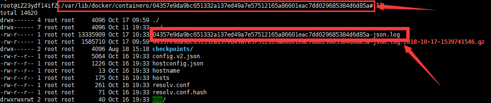
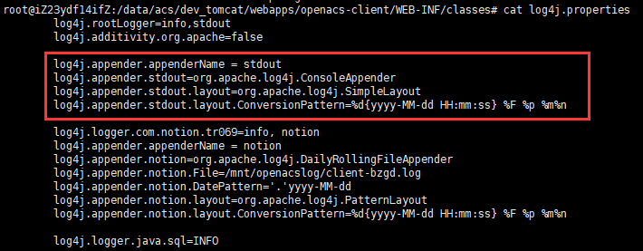
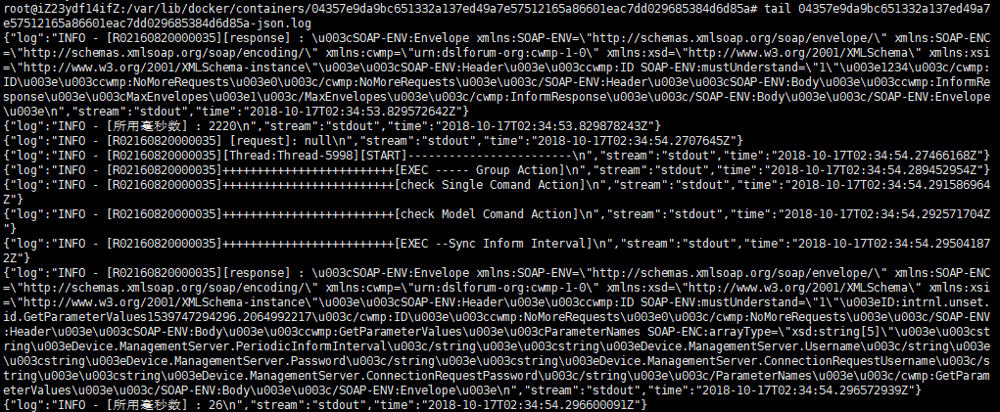

# 一、修改默认存储位置
## 1、查看当前存储位置
```
docker info
```


## 2、停止Docker服务
```
service docker stop
```

## 3、备份并建立软链接
```
cd /var/lib

# 备份原目录
cp -rf docker docker.bak

# 将原目录复制到目标磁盘目录下
cp -rf docker /<my_new_location>/

# 在当前目录创建同名软链接
ln -s /<my_new_location>/docker docker
```

## 4、启动Docker服务
```
service docker start
```

# 二、修改 docker 的时区
## 1、对于运行中的容器
```
docker cp /etc/localtime [容器ID或者NAME]:/etc/localtime
```

## 2、在创建容器的 DockerFile 中

```
ENV TZ=Asia/Shanghai
RUN ln -snf /usr/share/zoneinfo/$TZ /etc/localtime && echo $TZ > /etc/timezone
```

# 三、docker的日志
## 1、docker中的stdout

```
docker中的服务，输出到 stdout 的信息，会存储到容器对应的位置
```



```
tomcat 中的 log4j 相应配置的输出，也将输出到 stdout
```


## 2、存储的日志，将以json形式保存


## 3、docker logs 命令
### a、命令选项
```
$ docker logs [OPTIONS] CONTAINER
  Options:
        --details        显示更多的信息
    -f, --follow         跟踪日志输出，最后一行为当前时间戳的日志
        --since string   显示自具体某个时间或时间段的日志
        --tail string    从日志末尾显示多少行日志， 默认是all
    -t, --timestamps     显示时间戳
```
### b、日志时间例举
```bash
$ docker logs --since 30m 26b12d17fefc
  nohup: appending output to 'nohup.out'
$ docker logs -t --since="2017-07-03T13:58:54.232003809Z" 26b12d17fefc
  2017-07-03T13:58:54.232003809Z nohup: appending output to 'nohup.out'
$ docker logs -t --since="2017-07-03T12:12:29.909710295Z" 26b12d17fefc
  2017-07-03T12:12:29.909710295Z nohup: appending output to 'nohup.out'
  2017-07-03T13:58:54.232003809Z nohup: appending output to 'nohup.out'
```

## 4、docker 日志的 logrotate
```
cat /etc/logrotate.d/docker-json 
```
```
/var/lib/docker/containers/*/*json.log {
  daily
  missingok
  copytruncate
  notifempty
  create
  rotate 2
  dateext
  dateformat .%Y-%m-%d-%s
  compress
}
```

# 四、docker 启动 API 端口
## 1、添加网段至启动参数
```
vim /etc/default/docker
    DOCKER_OPTS="-H tcp://0.0.0.0:2376 -H unix:///var/run/docker.sock"
```

## 2、修改服务选项并重载
```
vim /lib/systemd/system/docker.service
    [Service]下添加：
    EnvironmentFile=-/etc/default/docker
    同时修改：
    ExecStart=/usr/bin/dockerd -H fd://
    成
    ExecStart=/usr/bin/dockerd -H fd:// $DOCKER_OPTS

systemctl daemon-reload
```

## 3、使用例举
```
docker -H 192.168.112.171:2376 image ls
```

# 五、容器间的目录共享
>--volumes-from
>
>将一个运行的容器作为数据卷，让其他容器通过挂载这个容器实现数据共享
```
docker run -itd -v /data --name dvdata ubuntu
docker run -itd --name web01 --volumes-from dvdata ubuntu
docker run -itd --name web02 --volumes-from dvdata ubuntu
```
```
docker exec dvdata touch /data/1.txt
docker exec web01 ls /data
docker exec web02 ls /data
```

# 六、修改mysql配置文件步骤
## 1、确认当前需要修改的配置文件位置
```
docker exec mysql1 ls /etc/mysql/mysql.conf.d/
    mysqld.cnf
```
## 2、将配置文件复制到宿主机
```
docker cp mysql1:/etc/mysql/mysql.conf.d/mysqld.cnf ./
```

## 3、修改后将配置文件复制到容器中
```
docker cp mysqld.cnf mysql1:/etc/mysql/mysql.conf.d/mysqld.cnf
```


