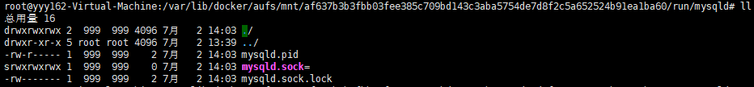

# 一、应用例举
## 1、docker安装rabbitmq
```
docker run -d --name rabbitmq --publish 5671:5671 --publish 5672:5672 --publish 4369:4369 --publish 25672:25672 --publish 15671:15671 --publish 15672:15672 rabbitmq:management
```
>http://宿主机IP:15672
>
>用户密码 guest

## 2、docker安装activemq
```
docker run -d --name myactivemq -p 61616:61616 -p 8161:8161 docker.io/webcenter/activemq:latest
```

## 3、创建nginx容器实例
```
docker run -p 8080:80 --name mynginx -v /usr/share/nginx/html:/usr/share/nginx/html -v /etc/nginx/conf.d:/etc/nginx/conf.d -d 9e12b654d3cc
	-p 端口映射
	-P 将创建随机映射端口
	--name 创建的容器的名称
	-v 复制文件
	-d 后台执行
	最后为镜像的id
```

## 4、创建mysql容器实例
```
docker run -p 3307:3306 --name mysql1 -e MYSQL_ROOT_PASSWORD=root -d mysql:5.7
	-p 3306:3306 端口映射
	-v $PWD/conf/my.cnf:/etc/mysql/conf.d/ 将主机当前目录下的 conf/my.cnf 挂载到容器的 /etc/mysql/my.cnf
	-v $PWD/logs:/var/log/mysql 将主机当前目录下的 logs 目录挂载到容器的 /var/log/mysql
	-v $PWD/data:/var/lib/mysql 将主机当前目录下的data目录挂载到容器的 /var/lib/mysql
	-e MYSQL_ROOT_PASSWORD=root 初始化 root 用户的密码

# 进入MySQL容器中
docker exec -it 961ba363c205 bash

# 访问容器内的mysql
mysql -h127.0.0.1 -P3309 -uroot -p

# 以sock文件进入mysql，sock文件见下图
mysql -S mysqld.sock -uroot -proot
```


## 5、安装redis
```
# 创建映射目录并放入配置文件，必须前台执行
mkdir /data/redis
vim /data/redis/redis.conf
    daemonize no

docker run --name redis1 -p 6379:6379 -v /data/redis:/data -d redis:5.0.0 redis-server /data/redis.conf
```


## 6、一次执行多条命令
```
# sh -c " "
docker run -i -t --name test111 -p 3000:3000 -p 18888:18888 --privileged=true node-mongo0901 sh -c 'servvice mongod start && npm run start'

docker run -d -p 8003:80 --name mynginx3 yuyiyu/nginx:5.0 sh -c "nginx -g 'daemon off;' && service cron start"
```

# 二、docker图形界面
## 1、单机部署
```
docker volume create portainer_data

docker run -d -p 9000:9000 -v /var/run/docker.sock:/var/run/docker.sock -v portainer_data:/data portainer/portainer

访问 http://IP:9000 
```

## 2、集群部署
```
docker service create \
--name portainer \
--publish 9000:9000 \
--replicas=1 \
--constraint 'node.role == manager' \
--mount type=bind,src=//var/run/docker.sock,dst=/var/run/docker.sock \
--mount type=bind,src=//opt/portainer,dst=/data \
portainer/portainer \
-H unix:///var/run/docker.sock

访问 http://IP:9000，网页中配置swarm
```

# 三、Harbor
## 1、安装docker-compose
```
apt-get install docker-compose

centos7安装docker-compose
1、安装yum库
yum install -y epel-release
2、安装 python-pip
yum install -y python-pip
3、安装docker-compose
pip install docker-compose

# 或直接下载二进制包
https://github.com/docker/compose/releases
mv docker-compose-Linux-x86_64 /usr/local/bin/docker-compose
chmod +x docker-compose

# 自动补全，修改版本
curl -L https://raw.githubusercontent.com/docker/compose/1.24.0/contrib/completion/bash/docker-compose -o /etc/bash_completion.d/docker-compose
```

## 2、下载harbor二进制包
```
https://github.com/goharbor/harbor/releases
Download Binary ---> Harbor offline installer
```

## 3、修改配置文件
* harbor.cfg
```
# 主机名
hostname = ubuntu61-virtual-machine

# 使用http还是https
ui_url_protocol = http

# 最多支持多少个线程同时下载
max_job_workers = 10 

# 是否启用证书，如果前面为http时不用管
customize_crt = on

# 如果启用证书，系统会自动创建证书的路径
ssl_cert = /data/cert/server.crt
ssl_cert_key = /data/cert/server.key
secretkey_path = /data

# 默认的admin账户的密码
harbor_admin_password = Harbor12345
```

* docker-compose.yml
```
# 需要根据实际修改镜像存放位置
registry:
    volumes:
      - /data/registry:/storage:z
```

## 4、创建项目
```
./install
或
docker-compose up -f 配置文件(默认为docker-compose.yml) -p 项目名称(默认为目录名)

# 启动关闭
docker-compose stop
docker-compose start
```

## 5、网页访问
```
账户：admin
密码：Harbor12345

项目相当于dockerhub的用户名
```

# 四、创建带ssh的centos
## 1、获取官方镜像
```
docker pull centos:6.9
	pull 下载镜像
	: 指定版本，不指定则下载最新的
```

## 2、查看本机镜像
```
docker images
```

## 3、使用镜像创建容器
```
docker run -d -i -t --name centos1 centos:6.9 /bin/bash
	-d 后台运行
	-i 标准输入给容器
	-t 分配一个虚拟终端
	--name 自定义容器的名称
	centos:6.9 可以是镜像名称，也可以是镜像id
	/bin/bash 初始命令为"启动系统"
```

## 4、查看生成的容器
```
docker ps -a
```

## 5、关闭容器，启动容器
```
docker stop centos1
docker start centos1
```

## 6、进入容器
```
docker attach centos1
```

## 7、安装ssh服务
```
yum install -y openssh-server openssh-clients openssh

vim /etc/ssh/sshd_config
修改 UsePAM yes 为 UsePAM no ，取消证书登陆
# 允许root用户以任何认证方式登陆
#PermitRootLogin yes
# 不允许root用户以任何认证方式登陆
#PermitRootLogin no
# 只允许root用户以密钥认证方式登陆
#PermitRootLogin without-password
```

## 8、添加root用户密码
```
passwd 0
```

## 9、退出容器并将容器提交为本地镜像
```
exit
docker commit 容器id 自定义镜像名称
docker images
```

## 10、利用带ssh服务的自定义镜像，生成容器
```
docker run -d -p 18016:22 --name ssh1 centos_ssh /usr/sbin/sshd -D

docker ps -a
```

## 11、远程连接
```
主机IP 18016端口 用户root 密码0
```


