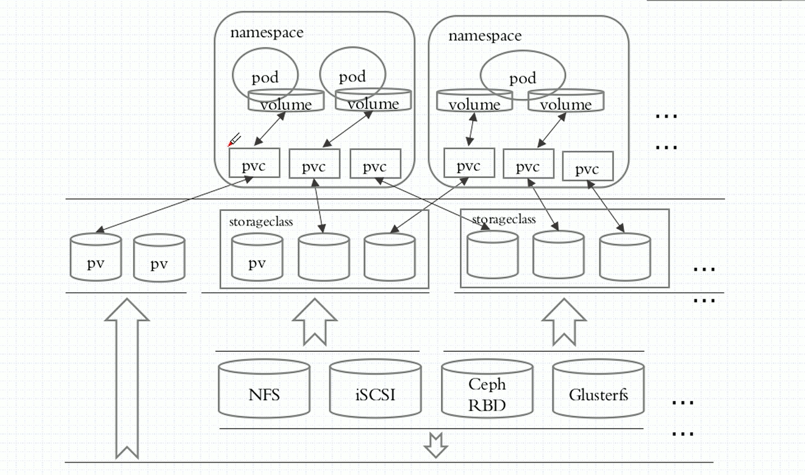

# 一、常用volume类型
* emptyDir
* hostPath
* 外部存储

>NAS
>>nfs和cifs

>SAN
>>iSCSI

>分布式存储
>>glusterfs和ceph/cephfs

>云存储
>>EBS和Azure Disk

# 二、emptyDir
>在容器中创建一个临时的空目录
>
>pod之间可以同时挂载相同目录，实现数据互通
```yaml
apiVersion: v1
kind: Pod
metadata:
  name: redis-pod
spec:
  containers:
  - image: redis
    name: redis
    volumeMounts:
    - mountPath: /cache
      name: cache-volume
  volumes:
  - name: cache-volume
    emptyDir: {}
```

# 三、hostPath
>将宿主机的目录挂载到容器对应目录
>
>必须保证每个节点都有这个目录

```yaml
apiVersion: v1
kind: Pod
metadata:
  name: nginx-html
spec:
  containers:
  - image: redis
    name: test-container
    volumeMounts:
    - mountPath: /usr/share/www/html
      name: test-volume
  volumes:
  - name: test-volume
    hostPath:
      path: /tmp/test
      type: Directory
```

```bash
echo "123" > /tmp/test/index.html
curl {CONTAINER_IP}
```

# 四、Pod容器共享Volume例举
## 1、创建包含两个容器的Pod
```yaml
apiVersion: v1
kind: Pod
metadata:
  name: volume-pod
spec:
  containers:
  - name: tomcat
    image: tomcat
    ports:
    - containerPort: 8080
    volumeMounts:
    - name: app-logs
      mountPath: /usr/local/tomcat/logs
  - name: busybox
    image: busybox
    command: ["sh", "-c", "tail -f /logs/catalina*.log"]
    volumeMounts:
    - name: app-logs
      mountPath: /logs
  volumes:
  - name: app-logs
    hostPath:
      path: /data/test/tomcat
```
## 2、tomcat和busybox两个容器共享 app-logs
```
/data/test/tomcat
    hostPath指定挂载到宿主机的外层目录位置

/usr/local/tomcat/logs
    tomcat容器中的日志目录

/logs
    busybox容器中的日志目录
```

## 3、查看容器内的日志目录

```bash
kubectl exec -it volume-pod -c busybox -- ls /logs
kubectl exec -it volume-pod -c tomcat -- ls /usr/local/tomcat/logs
```
>由于设置了 command ["sh", "-c", "tail -f /logs/catalina*.log"]
>
>busybox的 stdout可以直接查看日志输出
```bash
kubectl exec -it volume-pod -c busybox
```

# 五、NFS例举
```yaml
apiVersion: extensions/v1beta1
kind: Deployment
metadata:
  name: nginx-deployment
spec:
  replicas: 3
  template:
    metadata:
      labels:
        app: nginx
    spec:
      containers:
      - name: nginx
        image: nginx
        volumeMounts:
        - name: wwwroot
          mountPath: /usr/share/nginx/html
        ports:
        - containerPort: 80
      volumes:
      - name: wwwroot
        nfs:
          server: 192.168.112.171       # nfs的地址
          path: /data/nfs/test1         # nfs的目录
```

# 六、glusterfs例举
## 1、创建gluster集群
```
https://docs.gluster.org/en/latest/Quick-Start-Guide/Quickstart/
```

## 2、创建glusterfs入口
* 下载创建json文件
```bash
wget https://raw.githubusercontent.com/kubernetes/examples/master/staging/volumes/glusterfs/glusterfs-endpoints.json
```
* 修改glusterfs的主机和端口
```
  "subsets": [
    {
      "addresses": [{ "ip": "10.240.106.152" }],
      "ports": [{ "port": 1 }]
    },
    {
      "addresses": [{ "ip": "10.240.79.157" }],
      "ports": [{ "port": 1 }]
    }
  ]
```
* 查看endpoints
```bash
kubectl get endpoints
```
```
NAME                ENDPOINTS
glusterfs-cluster   10.240.106.152:1,10.240.79.157:1
```

## 3、创建glusterfs出口

```bash
wget https://raw.githubusercontent.com/kubernetes/examples/master/staging/volumes/glusterfs/glusterfs-service.json
```

## 4、创建pod使用glusterfs

```yaml
apiVersion: extensions/v1beta1
kind: Deployment
metadata:
  name: nginx-glusterfs
spec:
  replicas: 3
  template:
    metadata:
      labels:
        app: nginx
    spec:
      containers:
      - name: nginx
        image: nginx
        volumeMounts:
        - name: glusterfs-cluster
          mountPath: /usr/share/nginx/html
        ports:
        - containerPort: 80
      volumes:
      - name: glusterfsvol
        glusterfs:
          endpoints: glusterfs-cluster      # 与endpoints创建的名称对应
          path: gv0                         # 与glusterfs卷名称对应
          readOnly: false
```


## 5、查看glusterfs是否挂载正确

```bash
kubectl exec nginx-glusterfs -- mount | grep gluster
```
```
10.240.106.152:kube_vol on /mnt/glusterfs type fuse.glusterfs (rw,relatime,user_id=0,group_id=0,default_permissions,allow_other,max_read=131072)
```

# 七、PV与PVC
* PV      对存储抽象实现，使得存储作为集群中的资源
* PVC     PVC消费PV的资源


## 1、PV的yaml简略格式

* kubectl explain pv
>PV属于集群资源，与namespace平级，不能属于namespace

```
KIND:     PersistentVolume
VERSION:  v1

FIELDS:
    apiVersion	<string>
    kind	<string>
    
    metadata	<Object>
        name
        labels
        annotations

    spec	<Object>        # 此字段选项与Pod的spec.volumes类似
        accessModes <[]string>  # 可以列表指定多个
        
        capacity:               # 指定空间大小
            storage: 5Gi

        persistentVolumeReclaimPolicy:      # 空间回收策略
            
    status	<Object>
```

* accessModes
```
ReadWriteOnce       读写挂载单个节点
ReadOnlyMany        只读挂载多个节点
ReadWriteMany       读写挂载多个节点
```
* persistentVolumeReclaimPolicy
```
Retain          默认，不随pod删除而删除，需手动删除
Recycle         清空PV的数据，其他pod将能使用
Delete          关联的资产将会被删除，适用于云存储
```

## 2、PVC的yaml简略格式
* kubectl explain pvc
>a、通过 volumeName\volumeMode\selector 选择对应的后端存储
>
>b、如果不指定，系统将按请求的存储空间大小任意匹配
>
>c、如果没有满足条件的后端存储卷，PVC将处于Pending等待状态
>
>d、绑定状态的PV，是无法删除的
>
>e、PVC属于namespace，只能被同一namespace资源使用

```
KIND:     PersistentVolumeClaim
VERSION:  v1

FIELDS:
    apiVersion	<string>

    kind	<string>

    metadata	<Object>
        name
        namespace
        labels

    spec	<Object>   
        accessModes	<[]string>      # 必须是使用PV相应字段的子集

        resources	<Object>        # 请求的资源限制
            limits          <map[string]string>     # 最大值
            requests        <map[string]string>     # 最小值
                storage:

        selector	<Object>        # 选择器
        storageClassName	<string>
        volumeMode	<string>        # 后端存储卷的模式
        volumeName	<string>        # 后端存储卷的名称
            
    status	<Object>
```

# 八、PV-PVC-Pod例举
## 1、创建静态PV
* nfs例举
```yaml
apiVersion: v1 
kind: PersistentVolume 
metadata: 
  name: nfs-pv 
spec: 
  capacity: 
    storage: 5Gi 
  volumeMode: Filesystem 
  accessModes: 
  - ReadWriteOnce 
  persistentVolumeReclaimPolicy: Recycle 
  storageClassName: slow 
  nfs:                      # 使用nfs插件
    path: /tmp              # nfs共享目录为/tmp 
    server: 192.168.5.150   # nfs服务器的地址
```
* glusterfs例举
```yaml
apiVersion: v1 
kind: PersistentVolume 
metadata: 
  name: nfs-pv 
spec: 
  capacity: 
    storage: 5Gi 
  volumeMode: Filesystem 
  accessModes: 
  - ReadWriteOnce 
  persistentVolumeReclaimPolicy: Recycle 
  storageClassName: slow 
  glusterfs:                        # 使用glusterfs插件
    endpoints: "glusterfs-cluster"  # 与前面的endpoints对应
    path: "gv0"                     # glusterfs的磁盘名称
    readOnly: false
```

## 2、创建PVC使用静态PV
>不用具体指定，PVC会根据访问策略和请求磁盘大小，匹配PV
```yaml
apiVersion: v1
kind: PersistentVolumeClaim
metadata:
  name: nginx-pvc
spec:
  accessModes:
    - ReadWriteOnce
  resources:
    requests:
      storage: 5Gi
```

## 3、创建Pod使用PVC

```yaml
apiVersion: v1
kind: Pod
metadata:
  name: nginx-with-pvc
spec:
  containers:
  - image: nginx
    name: nginx-with-pvc
    volumeMounts:
    - mountPath: /usr/share/nginx/html
      name: my-pvc
  volumes:
  - name: my-pvc
    persistentVolumeClaim:
      claimName: nginx-pvc              # 与PVC名称对应
```

# 八、一键创建动态PVC
>当pod请求PVC时，PVC会动态创建需要的PV，从而应用到pod中

## 1、下载项目
https://github.com/helm/charts

## 2、创建动态PVC

```bash
helm install --set nfs.server=x.x.x.x --set nfs.path=/exported/path stable/nfs-client-provisioner
```

```
--set nfs.server=x.x.x.x            # 指定nfs地址
--set nfs.path=/exported/path       # 指定nfs目录
--name my-release                   # 可以指定创建的PVC的版本
```

## 3、删除指定版本的PVC

```bash
helm delete my-release
```

## 4、创建Pod使用动态PVC
>使用方法对于Pod一样，只需指定PVC的storageClass
```yaml
apiVersion: v1
kind: Pod
metadata:
  name: nginx-with-pvc
spec:
  containers:
  - image: nginx
    name: nginx-with-pvc
    volumeMounts:
    - mountPath: /usr/share/nginx/html
      name: my-pvc
  volumes:
  - name: my-pvc
    persistentVolumeClaim:
      claimName: nfs-pvc              # 与动态PVC名称对应
```